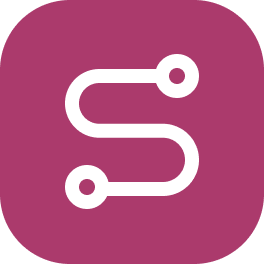

<div align="center">

<h2>Frappe PMS</h2>
</div>

## Introduction

This Frappe app integrates the Leave Management module with Slack, allowing seamless leave application and approval workflows directly within Slack.

## Key Features

- **Apply for Leave**: Use a custom Slack command to apply for leave. For example:
   ```
   /apply-leave
   ```
   This will open up a modal that you can use to submit your leave details.

- **Leave Approval/ Rejection**: Leave approvers will receive a Slack notification with options to either Approve or Reject the leave directly from Slack.

- **Daily Leave Reminders**: Every working day at the specified time, a Slack message will list all employees currently on leave.


## Installation

Run the following command to install the app.

```bash
bench get-app https://github.com/rtCamp/frappe-slack-connector
bench --site [site-name] install-app frappe_slack_connector
```

For local development, check out our dev-tool for seamlessly building Frappe apps: [frappe-manager](https://github.com/rtCamp/Frappe-Manager)


## Documentation

Please refer to our [Wiki](https://github.com/rtCamp/frappe-slack-connector/wiki) for details.

## Contribution Guide

Please read [contribution.md](./CONTRIBUTING.md) for details.

## License

This project is licensed under the [AGPLv3 License](license.txt).
