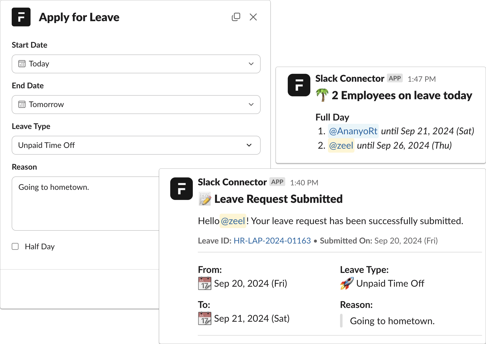

<div align="center">

<h2>Frappe Slack Connector</h2>
   Frappe app that integrates the Leave Management module with Slack.
</div>
<br>
<div align="center">

</div>

## Key Features

- **Apply for Leave**: Use a custom Slack command to apply for leave. For example:
   ```
   /apply-leave
   ```
   This will open up a modal that you can use to submit your leave details.

- **Leave Approval/ Rejection**: Leave approvers will receive a Slack notification with options to either Approve or Reject the leave directly from Slack.

- **Daily Leave Reminders**: Every working day at the specified time, a Slack message will list all employees currently on leave.

## Prerequisite

Before you begin, make sure you have following apps installed on your site:

- [ERPNext](https://github.com/frappe/erpnext)
- [Frappe HR](https://github.com/frappe/hrms)

## Installation

Run the following command to install the app.

```bash
bench get-app https://github.com/rtCamp/frappe-slack-connector
bench --site [site-name] install-app frappe_slack_connector
bench --site [site-name] migrate
bench restart
```

For local development, check out our dev-tool for seamlessly building Frappe apps: [frappe-manager](https://github.com/rtCamp/Frappe-Manager)  
NOTE: If using `frappe-manager`, you might require to `fm restart` to provision the worker queues.

## Slack Setup
Visit the detailed [Slack setup guide](https://github.com/rtCamp/frappe-slack-connector/wiki/Getting-Started) on wiki.

## Documentation

Please refer to our [Wiki](https://github.com/rtCamp/frappe-slack-connector/wiki) for details.

## Contribution Guide

Please read [contribution.md](./CONTRIBUTING.md) for details.

## License

This project is licensed under the [AGPLv3 License](license.txt).
